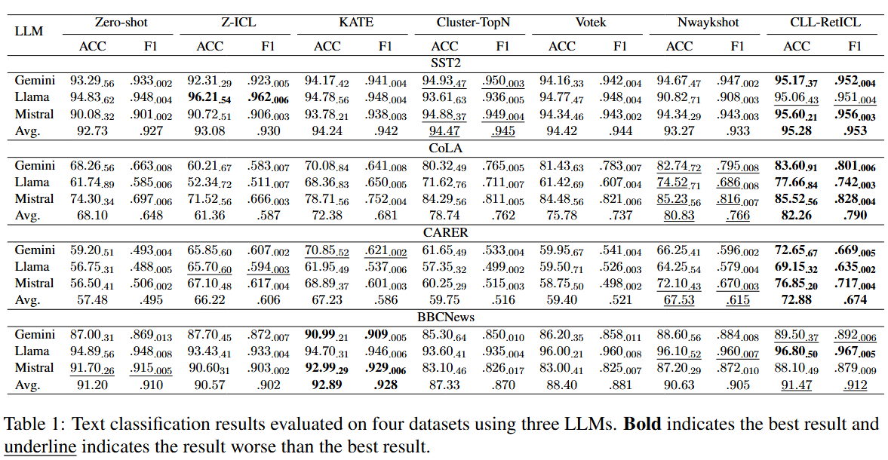
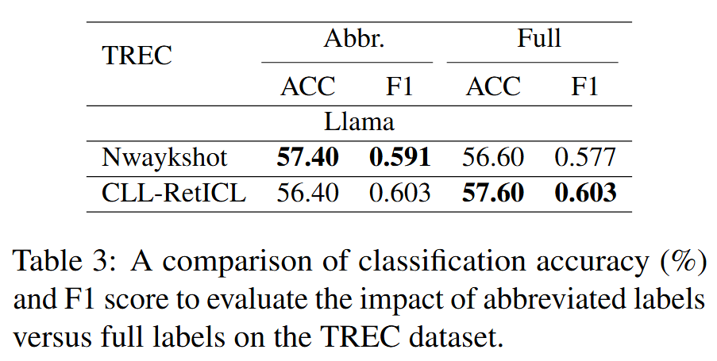
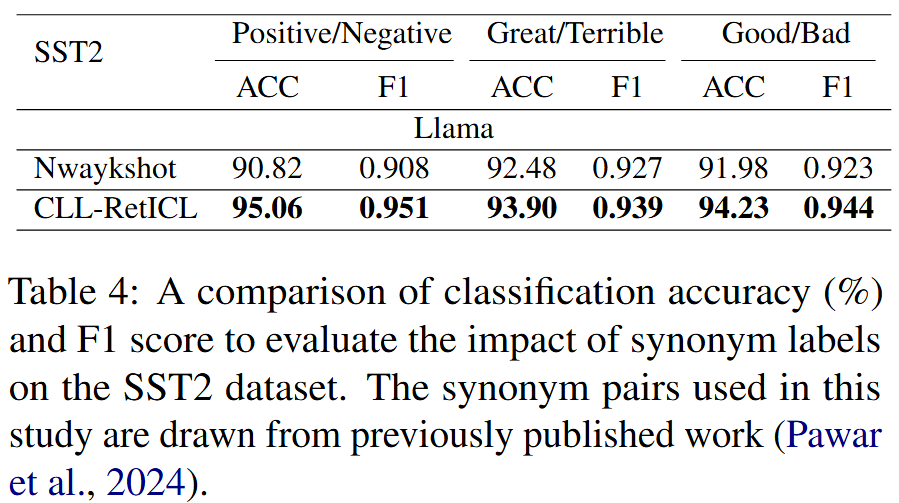

# CLL-RetICL: Contrastive Linguistic Label Retrieval-based In-Context Learning for Text Classification via Large Language Models
This repo is for our Findings of IJCNLP-AACL 2025 paper "CLL-RetICL: Contrastive Linguistic Label Retrieval-based In-Context Learning for Text Classification via Large Language Models".

## Dataset
Please download the SST2 dataset from [1], CoLA dataset from [2], CARER dataset from [3], and BBCnews dataset from [4]. 

## CLL-RetICL Structure
<p align="center">
  
  
</p>

## CLL-RetICL Performance


<p align="center">
  
  
</p>


## Citation
[1] Socher, R., Perelygin, A., Wu, J., Chuang, J., Manning, C. D., Ng, A. Y., & Potts, C. (2013, October). Recursive deep models for semantic compositionality over a sentiment treebank. In Proceedings of the 2013 conference on empirical methods in natural language processing (pp. 1631-1642).

[2] Warstadt, A., Singh, A., & Bowman, S. R. (2019). Neural network acceptability judgments. Transactions of the Association for Computational Linguistics, 7, 625-641.

[3] Saravia, E., Liu, H. C. T., Huang, Y. H., Wu, J., & Chen, Y. S. (2018). CARER: Contextualized affect representations for emotion recognition. In Proceedings of the 2018 conference on empirical methods in natural language processing (pp. 3687-3697).

[4] Greene, D., & Cunningham, P. (2006, June). Practical solutions to the problem of diagonal dominance in kernel document clustering. In Proceedings of the 23rd international conference on Machine learning (pp. 377-384).

If this repo is useful for you, please consider citing our paper:
```
@inproceedings{lin2025cll,
  title={CLL-RetICL: Contrastive Linguistic Label Retrieval-based In-Context Learning for Text Classification via Large Language Models},
  author={Lin, Chaohao and Wu, Kaida and Xiang, Peihao and Wu, Yanzhao and Bai, Ou},
  booktitle={Proceedings of the 14th International Joint Conference on Natural Language Processing and the 4th Conference of the Asia-Pacific Chapter of the Association for Computational Linguistics},
  pages={1575--1590},
  year={2025}
}
```
